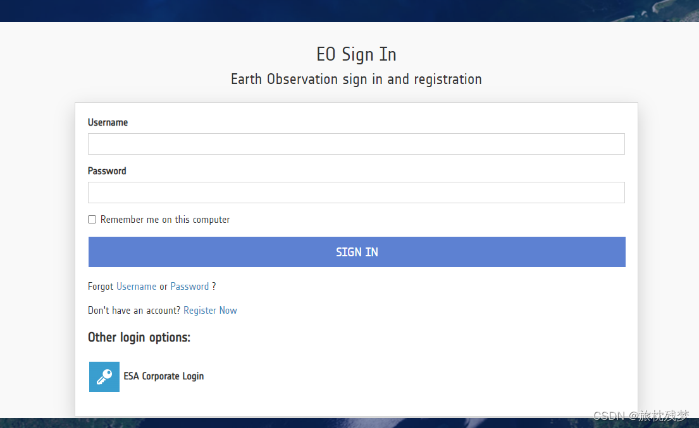
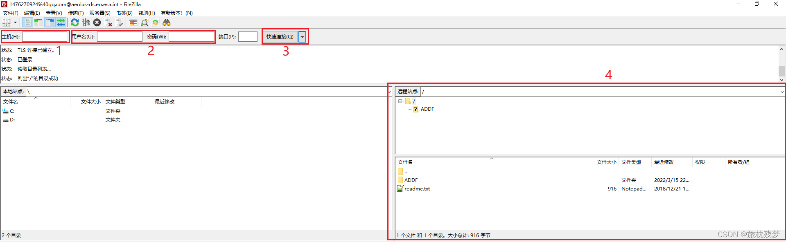
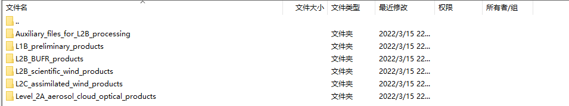

# 一. Aeolus卫星概况

Aeolus卫星作为第一颗观测全球范围风廓线的多普勒激光雷达卫星，于2018年8月22日发射升空。其以7天的重复周期运行在约320km的太阳同步轨道上。ESA目前已发布了由其原始数据生产的多种产品：Level-1B初始产品、Level-2A气溶胶/云光学产品、Level-2B科学风产品和Level-2C同化风产品等（https://aeolus-ds.eo.esa.int/oads/access/）。

Aeolus卫星提供的全球风廓线数据可广泛应用于数值天气预报、理解大气污染传播机理、极端天气预测等领域。

<!--more-->

# 二. Aeolus卫星数据下载
 1. **注册ESA账号**
登录ESA官网（https://aeolus-ds.eo.esa.int/oads/access/login），注册一个ESA账号



2. **下载FileZilla**
上FileZilla官网(https://www.filezilla.cn/)即可免费下载


3. **Aeolus数据下载**
打开FileZilla，输入主机、用户名、密码等，然后点击连接，右侧（图中的4区域）就会出现Aeolus服务器上的数据文件夹。
- 主机：```aeolus-ds.eo.esa.int```

- 用户名、密码：输入第一步注册的用户名和密码

  

​	点进ADDF文件夹，就会出现Aeolus的多种产品。



​	可以右键点击下载，也可以直接将文件拖拽入本地

