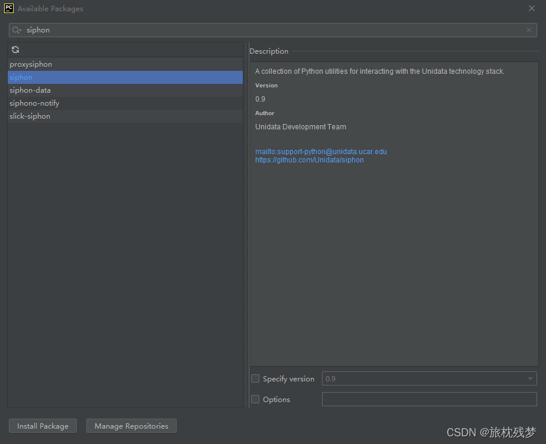
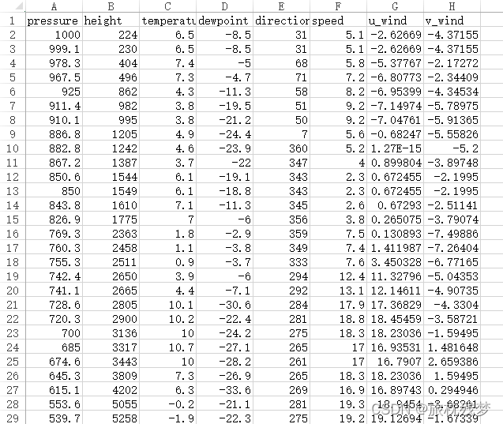

# 0 说明
已有很多作者发布了有关下载怀俄明大学探空数据的博客，但使用python的较少。且近期发现网站上<mark>中国地区的站点都消失了</mark>。发邮件询问了一下，原来是中国提供的数据格式更改成了BURF，<mark>他们在一个新的网站上提供这些数据：http://weather.uwyo.edu/upperair/bufrraob.shtml。新的网站上可以看到中国地区的站点</mark>。

下面开始正题

<!--more-->

# 1 下载Siphon
siphon是pyhton语言写的一个工具包，可以用来下载预报数据、再分析数据以及怀俄明的探空数据。我们在其基础上修改代码以适配新网站的格式。可以采用两种方式下载：

1. 手动下载，然后手动添加到项目文件夹中
siphon下载地址：https://unidata.github.io/siphon/latest/examples/upperair/Wyoming_Request.html#sphx-glr-examples-upperair-wyoming-request-py

2. 通过Pycharm等导入第三方包来下载，此方法更加便捷，<mark>推荐使用</mark>
具体直接搜索siphon即可下载

# 2 修改siphon中的数据网址
因为siphon包还未更新至新的数据网站，仍然访问的是旧网站，就会下载不到任何数据。所以需要修改其中的部分代码。

- **（1）** 防止访问太过频繁而被网站封禁，添加多个IP地址和代理 <mark>（可以跳过此步）</mark>
打开siphon中的http_util.py文件，找到```create_session(self)```函数修改为以下内容：
```python
    def create_session(self):
        """Create a new HTTP session with our user-agent set.

        Returns
        -------
        session : requests.Session
            The created session

        See Also
        --------
        urlopen, set_session_options

        """
        my_headers = [
            "Mozilla/5.0 (Windows NT 6.3; WOW64) AppleWebKit/537.36 (KHTML, like Gecko) Chrome/39.0.2171.95 Safari/537.36",
            "Mozilla/5.0 (Macintosh; Intel Mac OS X 10_9_2) AppleWebKit/537.36 (KHTML, like Gecko) Chrome/35.0.1916.153 Safari/537.36",
            "Mozilla/5.0 (Windows NT 6.1; WOW64; rv:30.0) Gecko/20100101 Firefox/30.0",
            "Mozilla/5.0 (Macintosh; Intel Mac OS X 10_9_2) AppleWebKit/537.75.14 (KHTML, like Gecko) Version/7.0.3 Safari/537.75.14",
            "Mozilla/5.0 (compatible; MSIE 10.0; Windows NT 6.2; Win64; x64; Trident/6.0)",
            'Mozilla/5.0 (Windows; U; Windows NT 5.1; it; rv:1.8.1.11) Gecko/20071127 Firefox/2.0.0.11',
            'Opera/9.25 (Windows NT 5.1; U; en)',
            'Mozilla/4.0 (compatible; MSIE 6.0; Windows NT 5.1; SV1; .NET CLR 1.1.4322; .NET CLR 2.0.50727)',
            'Mozilla/5.0 (compatible; Konqueror/3.5; Linux) KHTML/3.5.5 (like Gecko) (Kubuntu)',
            'Mozilla/5.0 (X11; U; Linux i686; en-US; rv:1.8.0.12) Gecko/20070731 Ubuntu/dapper-security Firefox/1.5.0.12',
            'Lynx/2.8.5rel.1 libwww-FM/2.14 SSL-MM/1.4.1 GNUTLS/1.2.9',
            "Mozilla/5.0 (X11; Linux i686) AppleWebKit/535.7 (KHTML, like Gecko) Ubuntu/11.04 Chromium/16.0.912.77 Chrome/16.0.912.77 Safari/535.7",
            "Mozilla/5.0 (X11; Ubuntu; Linux i686; rv:10.0) Gecko/20100101 Firefox/10.0 "
            ]
        proxy_list = [
            'http://121.43.190.89:3128',
            'http://221.224.136.211:35101',
            'http://103.216.103.25:80',
            'http://175.10.223.95:8060',
            'http://121.43.190.89:3128',
            'http://222.112.240.167:80'
            'http://218.75.102.198:8000'
            'http://23.254.161.181:80'
        ]
        # print(random.choice(proxy_list))

        ret = requests.Session()
        ret.headers['User-Agent'] = random.choice(my_headers)
        ret.proxies.update({"http:":random.choice(proxy_list)})
        # print(ret.headers['User-Agent'])
        # print(ret.proxies)

        for k, v in self.options.items():
            setattr(ret, k, v)
        return ret
```


- **（2）** 修改下载的网址
找到函数```__init__(self):```，将其中的super语句修改为：
```python
super(WyomingUpperAir, self).__init__('http://weather.uwyo.edu/cgi-bin/bufrraob.py')
```
找到函数```_get_data_raw(self, time, site_id)```，将其中的path修改为：
```python
path = ('?src=bufr&datetime={time:%Y-%m-%d}%20{time:%H}:00:00&id={stid}&type=TEXT:LIST').format(time=time, stid=site_id)
#某站点某天数据网址示例 'http://weather.uwyo.edu/cgi-bin/bufrraob.py?src=bufr&datetime=2021-01-01%2012:00:00&id=54511&type=TEXT:LIST'
```

- **（3）** 修改数据提取代码
由于新网站结构格式与原网站不同，比如新网站不再有每个站点的经纬度信息等。所以我们需要修改代码以匹配新网站，从中提取出我们需要的信息。
找到函数```_get_data(self, time, site_id)```，将其修改为：
```python
    def _get_data(self, time, site_id):
        r"""Download and parse upper air observations from an online archive.

        Parameters
        ----------
        time : datetime
            The date and time of the desired observation.

        site_id : str
            The three letter ICAO identifier of the station for which data should be
            downloaded.

        Returns
        -------
            :class:`pandas.DataFrame` containing the data

        """
        # 天气数据爬虫文本提取
        raw_data = self._get_data_raw(time, site_id)
        soup = BeautifulSoup(raw_data, 'html.parser')
        tabular_data = StringIO(soup.find_all('pre')[0].contents[0])

        print(soup.find_all('pre')[0].contents[0])
        col_names = ['pressure', 'height', 'temperature', 'dewpoint', 'direction', 'speed']
        df = pd.read_fwf(tabular_data, skiprows=5, sep=' ',infer_nrows=1000 , usecols=[0, 1, 2, 3, 6, 7], names=col_names)
        print(df)
        df['u_wind'], df['v_wind'] = get_wind_components(df['speed'],
                                                         np.deg2rad(df['direction']))

        # Drop any rows with all NaN values for T, Td, winds
        df = df.dropna(subset=('temperature', 'dewpoint', 'direction', 'speed',
                               'u_wind', 'v_wind'), how='all').reset_index(drop=True)


        # Add unit dictionary
        df.units = {'pressure': 'hPa',
                    'height': 'meter',
                    'temperature': 'degC',
                    'dewpoint': 'degC',
                    'direction': 'degrees',
                    'speed': 'm/s',
                    'u_wind': 'm/s',
                    'v_wind': 'm/s',
                    }
      return df
```

# 3 批量下载数据
然后通过下面的代码就可以下载俄怀明的探空数据了：
```python
import pandas as pd

import datetime

import time

import os

from metpy.units import units

from siphon.simplewebservice.wyoming import WyomingUpperAir

# 新建文件夹函数，便于分站点存储数据
def mkdir(path):
    folder = os.path.exists(path)

    if not folder:  # 判断是否存在文件夹如果不存在则创建为文件夹
        os.makedirs(path)  # makedirs 创建文件时如果路径不存在会创建这个路径
    else:
        pass

# 设置下载时段（这里是UTC时刻）
start = datetime.datetime(2020, 1, 1, 0)
end = datetime.datetime(2020, 1, 1, 0)
datelist = []
while start<=end:
    datelist.append(start)
    start+=datetime.timedelta(hours=12)

datelist_s=[]
# 选择下载站点（以上海宝山站为例）
stationlist = ['57494']

# 可通过外部文件批量导入站点编号
# sta = pd.read_csv("station.csv",encoding = 'gb2312',dtype={"id": str})
# stationlist = sta['id']


nodata=[]
data_missing=[]
# 批量下载
for station in stationlist:
    datelist_s=datelist.copy()
    for date in datelist_s:
        try:
            df = WyomingUpperAir.request_data(date, station)
            mkdir('D:/RS_data/'+station)    
            df.to_csv('D:/RS_data/'+station+'/'+station+'_'+date.strftime('%Y%m%d%H')+'.csv',index=False)
            print(station+date.strftime('%Y%m%d_%H')+'下载成功')
        except Exception as e:
            print('错误类型是',e.__class__.__name__)
            print('错误明细是',e)
            print(station+date.strftime('%Y%m%d_%H')+'下载失败,原因如下：')
            if e.__class__.__name__=="IndexError":
                #加入无数据队列
                print(
                    'No data available for {time:%Y-%m-%d %HZ} '
                    'for station {stid}.'.format(time=date, stid=station))
                nodata.append(station+'_'+date.strftime('%Y%m%d%H'))

            elif e.__class__.__name__=="TypeError":
                print('Error data type in web page')
                nodata.append(station + '_' + date.strftime('%Y%m%d%H'))
            elif e.__class__.__name__=="KeyError":
                print('Missing data in web page')
                data_missing.append(station + '_' + date.strftime('%Y%m%d%H'))
                # 其他需要忽略下载的错误可以继续往下加


            else:
                #把下载失败日期加入到下载队列末端重新下载
                datelist_s.append((date))


 # 将无数据的站点及日期写入文件
 print("无数据提供的站点及日期：")
 print(nodata)
 f = open("nodata_12.txt", "w")
 for line in nodata:
     f.write(line + '\n')
 f.close()
 
 # 将数据列缺失的站点及日期写入文件
 print("数据列存在缺失的站点和日期：")
 print(data_missing)
 f = open("data_missing_12.txt", "w")
 for line in data_missing:
     f.write(line + '\n')
 f.close()

```

# 4 结果展示
- 各站点数据文件夹：
  

- 某站点下载的数据：

  

- 某站点某天探空数据展示：

